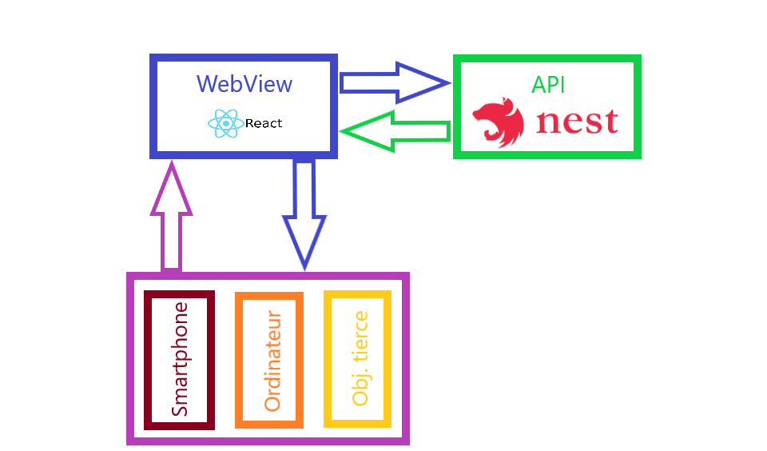

# ISEN Sondage

## Introduction

Ce projet à pour but de créer une application mobile/site web (accessible depuis un navigateur) de sondage rapide.
Tous utilisateurs peux créer ou répondre à des sondages simplement et rapidement.

## Architecture

Notre projet est composé d'une API qui gère toutes les données relatives aux sondages, et d'une webview qui gere l'affichage.


## Run project (using docker-compose)

Go to the sondage folder and run:
```
docker-compose build
docker-compose up -d
```
The -d parameters will launch the application in the background so you will get back your shell but you will not get the logs.
So remove it to get the logs.

The API will be exposed on the port 3546 and the APP on the 3243.

### API

[Readme API](api/README.md)


### APP

[Readme APP](app/README.md)
